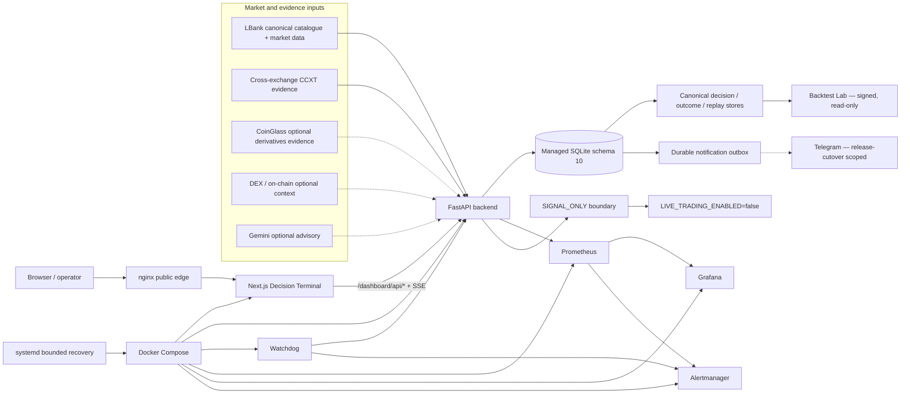

# Architecture

WaterfallHunter is a `SIGNAL_ONLY` decision system for short-side research on linear USDT perpetual futures. The supported runtime observes, scores, persists, explains, replays, and notifies; it does **not** place or cancel exchange orders.

For the time-bound operational state, deployed revision, provider availability, and deferred work, read [Current Status](CURRENT_STATUS.md).

## Canonical runtime topology

## Decision data flow

`market discovery -> contract identity -> normalized/fresh evidence -> cascade/context analysis -> canonical entry decision -> immutable persistence -> dashboard / outcomes / replay / durable notification`

Lifecycle (`WATCH`, `FUEL-RICH`, `PRE-TRIGGER`, `ARMED`, `TRIGGERED`, `EXHAUSTED`, `INVALIDATED`) is context. It is not the public entry decision. Only canonical `ENTRY_READY` is a proactive signal state.

## Responsibility boundaries

- `backend/`: FastAPI, discovery, provider/exchange evidence, lifecycle context, canonical decision engine, persistence, replay, outcomes, Backtest Lab, notification outbox, and APIs.
- `frontend/`: Next.js Decision Terminal. It consumes canonical backend state and must not duplicate ranking, eligibility, ScoreV2, Anti-Chase, or lifecycle decision logic.
- `watchdog/`: bounded health supervision and alert bridge.
- `deploy/`: nginx, systemd, Prometheus, Grafana, and Alertmanager configuration.
- `scripts/`: validation, migration, backup/restore, replay, calibration, release, and certification tooling.

## Evidence and provider boundary

LBank and cross-exchange evidence are normalized against canonical contract identity and freshness rules. Optional providers such as CoinGlass, DEX/on-chain sources, and Gemini are never allowed to manufacture missing deterministic evidence. Missing or invalid provider evidence is `UNAVAILABLE`, not bullish or bearish.

Gemini is advisory-only and cannot create, veto, promote, or downgrade a canonical decision. CoinGlass is optional evidence; provider entitlement failure must fail closed. See [AI Advisory](AI_ADVISORY.md) and [Current Status](CURRENT_STATUS.md).

## Persistence and notification boundary

Managed SQLite is the durable evidence source for decisions, outcomes, replay, execution observations, Backtest Lab input/output provenance, and notification state. Persistence precedes notification. Telegram delivery is disabled unless credentials, an explicit release-scoped cutover timestamp, and the delivery gate are all present.

## Safety boundary

`LIVE_TRADING_ENABLED=false` is mandatory. The current repository policy does not authorize live order placement. Historical or future execution ideas do not override this boundary without a separately reviewed repository-policy change.
